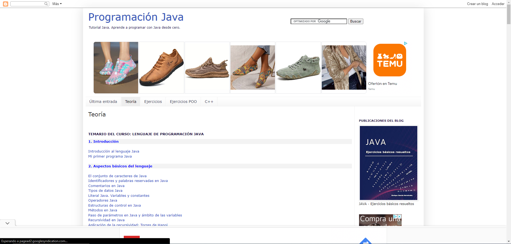

# Proyecto Calculadora

## Descripcion

Esto es una calculadora que te permite sumar,restar,multiplicar y dividir dos numeros para luego darte el resultado.

## Caracteristicas

Sencillo de usar: No hay muchos datos que insertar y todo esta bien explicado
Mejora: Da pie a implementar mas operaciones matematicas
Simpleza: Es un codigo muy sencillo que cualquier programador puede entender

## Uso

El uso es sencillo, solo necesitas insertar dos numeros y posteriormente elejir la operacion que requiera. En caso de escribir una operacion no valida se terminara sin ejecutar nada.

## Instalacion

```java
import java.util.Scanner;

public class CalculadoraBasica {
    public static void main(String[] args) {
        Scanner scanner = new Scanner(System.in);

        // Pedimos al usuario los dos números y la operación
        System.out.println("Introduce el primer número: ");
        double numero1 = scanner.nextDouble();

        System.out.println("Introduce el segundo número: ");
        double numero2 = scanner.nextDouble();

        System.out.println("Elige una operación (+, -, *, /): ");
        char operacion = scanner.next().charAt(0);

        // Variable para almacenar el resultado
        double resultado = 0;
        boolean operacionValida = true;

        // Realizamos la operación
        switch (operacion) {
            case '+':
                resultado = numero1 + numero2;
                break;
            case '-':
                resultado = numero1 - numero2;
                break;
            case '*':
                resultado = numero1 * numero2;
                break;
            case '/':
                if (numero2 != 0) {
                    resultado = numero1 / numero2;
                } else {
                    System.out.println("Error: División por cero no es permitida.");
                    operacionValida = false;
                }
                break;
            default:
                System.out.println("Operación no válida.");
                operacionValida = false;
        }

        // Mostramos el resultado
        if (operacionValida) {
            System.out.println("El resultado de " + numero1 + " " + operacion + " " + numero2 + " es: " + resultado);
        }

        scanner.close();
    }
}

```
## Lista de tareas

 Por hacer a corto plazo
1. Implementar la potencia de un numero 
2. Implementar la raiz de un numero
3. Implementar mas opereradores (numeros) al codigo

 Por hacer a largo plazo
- Implementar una Interfaz
- Implementar operaciones continuas
- Implementar resultados con mayor indice de decimales

## Tabla

Tabla de objetivos completados
|Nombre|Hecho|
|------|-----|
|Multiplicacion||
|Division||
|Raiz||
|Potencia||

## Enlaces a la web

Estos son enlaces para aprender java

- [PuntoComNoEsUnLenguaje](https://puntocomnoesunlenguaje.blogspot.com/p/teoria_7.html)



- [W3School](https://www.w3schools.com/java/default.asp)

